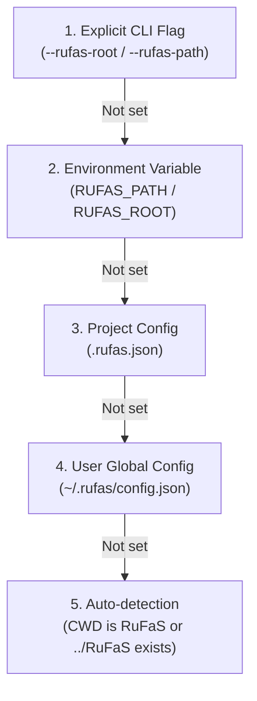

# RuFaS Agentic Tooling 🐄🌱

A portable, modular agentic engineering, knowledge graph, and diagnostic ecosystem for **RuFaS (Ruminant Farm Systems)** whole-farm dairy simulation modeling.

Adheres to the open [Agent Skills Specification](https://agentskills.io/specification) with multi-vendor AI CLI plugin support for **Google Antigravity**, **Anthropic Claude Code**, **Universal Agent Skills (`npx skills`)**, **GitHub Copilot**, **Cursor**, and **Windsurf**.

---

## ⚡ 1-Minute Quickstart

Choose your preferred environment:

### Option A: Install as an AI CLI Plugin (Recommended)

Install all 7 domain specialist skills directly into your AI assistant CLI with a single command:

```bash
# 🔹 Google Antigravity (AGY CLI)
agy plugin add https://github.com/thiago-f-santos/rufas-agentic-tooling

# 🔹 Anthropic Claude Code
claude plugin add https://github.com/thiago-f-santos/rufas-agentic-tooling

# 🔹 Universal Agent Skills CLI (Node / NPX)
npx skills add https://github.com/thiago-f-santos/rufas-agentic-tooling
```

---

### Option B: Python Developer & CLI Setup

For full access to diagnostic tools (`rufas-inspect`, `rufas-run`, `rufas-analyze`, `rufas-brain`, `rufas-setup`):

```bash
# 1. Clone this repository
git clone https://github.com/thiago-f-santos/rufas-agentic-tooling.git
cd rufas-agentic-tooling

# 2. Install package in editable mode
pip install -e .

# 3. Run interactive onboarding wizard
rufas-setup
```

The `rufas-setup` wizard automatically locates your RuFaS repository, clones it if needed, validates configuration schemas, and deploys specialist skills to all detected AI assistants.

---

### Option C: Universal Skills Deployment

Deploy specialist skills across all local AI coding runtimes (GitHub Copilot CLI, Cursor, Windsurf, Codex, Gemini CLI):

```bash
# Deploy to universal alias (~/.agents/skills) and all detected runtimes
rufas-install-skills --runtime all

# Or deploy directly into a target RuFaS repository (.agents/skills)
rufas-install-skills --project-repo /path/to/RuFaS
```

---

## 🎯 What is RuFaS Agentic Tooling?

**RuFaS (Ruminant Farm Systems)** is a modular, biophysical whole-farm simulation environment modeling dairy production, soil-crop-animal biogeochemistry, environmental footprints, economics, energy consumption, and greenhouse gas (GHG) emissions.

This tooling suite provides:
1. **7 Domain Specialist Skills (`skills/`)**: Grounded in biophysical science, lactation kinetics (Wood/Dijkstra), NASEM/NRC LP ration optimization, multi-layer hydrology, and ASABE machinery standards.
2. **Interactive Onboarding Wizard (`rufas-setup`)**: Streamlined repository onboarding, validation, auto-cloning, and skill installation.
3. **Operational Diagnostic Tooling (`tools/`)**: Metadata inspection (`rufas-inspect`), headless execution (`rufas-run`), mass/GHG balance analyzer (`rufas-analyze`), and multi-runtime installer (`rufas-install-skills`).
4. **Embedded Graph Memory Brain (`rufas-brain`)**: Embedded KùzuDB property graph capturing ontology, cross-run statistical correlations (Pearson $r$, Spearman $\rho$), causal impact tracing, 2,038 output variables catalog, OpenCypher queries, and Obsidian knowledge vault export.
5. **Zero-Config Portability**: Tiered configuration resolution hierarchy supporting global configs, project configs, environment variables, and automatic directory detection.

---

## 🧭 Onboarding & Path Resolution Guide

RuFaS Agentic Tooling is designed for seamless portability across machines, CI/CD runners, and developer environments.

### 5-Tier Path Resolution Hierarchy

When executing any CLI command or AI specialist skill, the target `RuFaS` codebase path is resolved using the following precedence:



1. **CLI Flag**: Explicit argument `--rufas-root /path/to/RuFaS` or `--rufas-path`.
2. **Environment Variable**: `export RUFAS_PATH=/path/to/RuFaS`.
3. **Project Configuration**: `.rufas.json` located in current working directory.
4. **User Global Configuration**: `~/.rufas/config.json` created by `rufas-setup`.
5. **Zero-Config Auto-detection**: Automatically detects if running inside a RuFaS repository (`.`) or adjacent folder (`../RuFaS`).

---

### Onboarding Wizard (`rufas-setup`)

The `rufas-setup` CLI tool configures and validates your RuFaS environment:

```bash
# 1. Interactive onboarding (guides step-by-step)
rufas-setup

# 2. Point directly to an existing RuFaS repository (Global user config)
rufas-setup --path /path/to/RuFaS

# 3. Configure local project repository (.rufas.json)
rufas-setup --path /path/to/RuFaS --local

# 4. Auto-clone official RuFaS repository into default adjacent directory (../RuFaS)
rufas-setup --clone

# 5. Auto-clone RuFaS into a custom destination
rufas-setup --clone --clone-dest /path/to/RuFaS

# 6. Non-interactive validation check
rufas-setup --check
```

---

## 🛠️ Operational CLI Tools Documentation

Each operational tool can be executed via its console script or as a Python module (`python -m tools.<tool_name>`).

### 1. `rufas-setup` — Onboarding & Configuration Manager

Configures, validates, and manages RuFaS repository bindings and AI skill installations.

```bash
# Run interactive wizard
rufas-setup

# Set path and deploy skills to all AI assistants
rufas-setup --path /path/to/RuFaS --install-skills

# Validate configuration without prompt
rufas-setup --check
```

**Common Flags:**
- `--path PATH`: Configure path to RuFaS repository.
- `--clone`: Clone official RuFaS repository from GitHub.
- `--clone-dest PATH`: Destination directory for cloning.
- `--local`: Save configuration to local `.rufas.json` instead of global `~/.rufas/config.json`.
- `--install-skills`: Install specialist skills into detected AI assistants.
- `--check`: Validate existing configuration and exit.

---

### 2. `rufas-inspect` — Metadata & Schema Validator

Validates input metadata, scenario definitions, JSON schemas, and cross-validation integrity across all 22 required configuration blobs.

```bash
# Inspect a specific scenario metadata file
rufas-inspect --scenario /path/to/RuFaS/input/metadata/example_freestall_dairy_metadata.json

# Inspect task manager metadata using auto-resolved RuFaS root
rufas-inspect

# Run via Python module
python -m tools.rufas_inspector --scenario /path/to/RuFaS/input/metadata/example_freestall_dairy_metadata.json
```

**Key Capabilities:**
- Validates JSON schema against `input/metadata/schema.json`.
- Verifies all 22 required configuration blobs are declared.
- Verifies cross-validation constraints (e.g. soil layers, herd demographics, crop schedules).

---

### 3. `rufas-run` — Simulation Execution Engine

Executes RuFaS simulations with managed output filters, timeout protections, and structured log capture.

```bash
# Run simulation using task manager metadata
rufas-run --task-metadata /path/to/RuFaS/input/task_manager_metadata.json

# Run simulation specifying custom RuFaS root
rufas-run --rufas-root /path/to/RuFaS
```

**Key Capabilities:**
- Headless execution with real-time log monitoring.
- Captures runtime exceptions, traceback logs, and non-zero exit codes.
- Structured diagnostics for missing input files or schema violations.

---

### 4. `rufas-analyze` — Output CSV & Biophysical Metrics Analyzer

Parses simulation CSV output files, computing mass balances (N, P, C, $\text{H}_2\text{O}$), greenhouse gas emissions, and herd productivity.

```bash
# Analyze simulation outputs in default or resolved output directory
rufas-analyze --output-dir /path/to/RuFaS/output

# Export full biophysical summary as structured JSON
rufas-analyze --output-dir /path/to/RuFaS/output --json
```

**Key Metrics Analyzed:**
- **Herd Dynamics**: Dry Matter Intake (DMI), daily milk production, milk protein/fat, feed efficiency.
- **Biogeochemistry**: Multi-layer soil water drainage, nitrogen leaching, phosphorus runoff.
- **Emissions**: Enteric methane ($\text{CH}_4$), manure storage emissions ($\text{CH}_4, \text{NH}_3, \text{N}_2\text{O}$), ASABE diesel fuel emissions, Scope 1-3 GHG totals.

---

### 5. `rufas-brain` — Embedded Graph Memory Brain (KùzuDB)

Embedded property graph database capturing biophysical ontology, simulation histories, cross-run statistical correlations, causal impact tracing, and Obsidian knowledge vault export.

```bash
# 1. Initialize KùzuDB and ingest biophysical ontology (modules, parameters, outputs, causal pathways)
rufas-brain init --db-path data/rufas_brain.kuzu

# 2. Ingest a completed simulation run from output CSVs
rufas-brain ingest --output-dir /path/to/RuFaS/output --run-id freestall_baseline --scenario example_freestall

# 3. Compute cross-run statistical correlations (Pearson r, Spearman rho, p-values)
rufas-brain compute-correlations --min-r 0.5 --max-p 0.05 --min-samples 3

# 4. Execute OpenCypher queries (tabular or JSON)
rufas-brain query "MATCH (m:Module) RETURN m.name, m.manager_class"
rufas-brain query "MATCH (p:InputParameter)-[r:CORRELATES_WITH]->(v:OutputVariable) RETURN p.id, v.name, r.pearson_r LIMIT 10" --json

# 5. Trace causal impact of an input parameter
rufas-brain trace-impact --param cow_num
rufas-brain trace-impact --param mature_body_weight --json

# 6. Lookup output variable catalog (2,038 variables)
rufas-brain lookup-var --name daily_milk_production
rufas-brain lookup-var --name enteric_methane --json

# 7. Export interactive Obsidian knowledge vault with Dataview DQL dashboards
rufas-brain export-obsidian --output-dir vault/
```

---

### 6. `rufas-install-skills` — Multi-Runtime Skill & Plugin Distributor

Installs and validates the 7 specialist skills and plugin manifests across all major AI assistant runtime directories. By default, `rufas-install-skills` establishes dynamic **symbolic links (symlinks)**, ensuring that modifications in your repository are immediately reflected across all AI CLI environments without requiring re-installation.

```bash
# Install to all supported AI assistants using symlinks (default)
rufas-install-skills --runtime all

# Install full plugin for Google Antigravity (~/.gemini/config/plugins/rufas-agentic-tooling)
rufas-install-skills --runtime antigravity

# Install specialist skills for Anthropic Claude Code (~/.claude/skills)
rufas-install-skills --runtime claude

# Install specialist skills to Universal Agent Skills alias (~/.agents/skills)
rufas-install-skills --runtime universal

# Install specialist skills into a target project repository (.agents/skills)
rufas-install-skills --project-repo /path/to/RuFaS

# Fallback: Copy physical directories instead of symbolic links
rufas-install-skills --runtime all --mode copy

# Run validation check without copying or linking files
rufas-install-skills --dry-run
```

---

## 🧠 Domain Specialist Skills Suite

The suite includes 7 specialized AI skills conforming to the [Agent Skills Specification](https://agentskills.io/specification). Each specialist provides domain-specific knowledge, biophysical formulas, parameter paths, and diagnostic procedures:

| Skill | Domain Scope & Biophysical Focus | Key Capabilities & Scientific Models | Slash Command |
| :--- | :--- | :--- | :--- |
| **`rufas`** | Whole-System Simulation & Lifecycle | Simulation lifecycle orchestration, 22-blob metadata graph, task manager configuration, input validation, execution monitoring, output triage. | `/rufas` |
| **`rufas-animal`** | Animal Biology, Herd & Nutrition | Lactation curve kinetics (Wood / Dijkstra), NASEM / NRC linear programming ration optimization, enteric methane ($\text{CH}_4$), nutrient partitioning, manure excretion. | `/rufas-animal` |
| **`rufas-field`** | Soil Water, Crops & Biogeochemistry | Multi-layer soil hydrology (Campbell/Richards), nitrogen/phosphorus/carbon cycling, crop growth kinetics (GDD/RUE), tillage & harvest management. | `/rufas-field` |
| **`rufas-feed`** | Feed Storage & Spoilage Kinetics | Storage structures (bunkers, upright silos, ag bags), dry matter degradation kinetics, aerobic spoilage, inventory tracking, ration fulfillment. | `/rufas-feed` |
| **`rufas-manure`** | Manure Handling, Treatment & Storage | Barn collection scrapers/flushers, solid-liquid separation, anaerobic digestion/biogas, storage lagoons, gaseous emissions ($\text{CH}_4, \text{NH}_3, \text{N}_2\text{O}$), field application. | `/rufas-manure` |
| **`rufas-eee`** | Economics, Energy & Lifecycle GHG | Income Over Feed Cost (IOFC), Cost of Production (COP), ASABE tractor diesel fuel equations, electricity demand, Scope 1, 2, and 3 GHG lifecycle accounting. | `/rufas-eee` |
| **`rufas-brain`** | Graph Memory Brain & Causal Ontology | KùzuDB property graph engine, 2,038 output variable dictionary, cross-run statistical correlations, causal impact paths, OpenCypher queries, Obsidian vault. | `/rufas-brain` |

---

## 📦 AI Assistant & CLI Vendor Installation Guide

### 1. Google Antigravity (`agy`)
Antigravity discovers skills and tools via plugin manifests (`plugin.json`):
- **Plugin Symlink / Install (Direct)**:
  ```bash
  rufas-install-skills --runtime antigravity
  ```
- **Remote Plugin Add**:
  ```bash
  agy plugin add https://github.com/thiago-f-santos/rufas-agentic-tooling
  ```

---

### 2. Anthropic Claude Code (`claude`)
Claude Code indexes skills from `.claude-plugin/plugin.json` or `~/.claude/skills/`:
- **Skills Symlink / Install (Direct)**:
  ```bash
  rufas-install-skills --runtime claude
  ```
- **Remote Plugin Add**:
  ```bash
  claude plugin add https://github.com/thiago-f-santos/rufas-agentic-tooling
  ```

---

### 3. Universal Agent Skills (`npx skills`)
Installs into universal standards-compliant agent directories (`~/.agents/skills`):
```bash
rufas-install-skills --runtime universal
# Or via npx skills package manager:

npx skills add https://github.com/thiago-f-santos/rufas-agentic-tooling
```

---

### 4. GitHub Copilot, Cursor, Windsurf, OpenAI Codex & Custom Runtimes
Modern AI coding tools load skills from the universal `.agents/skills` directory:
- **Global User Directory (`~/.agents/skills`)**:
  ```bash
  rufas-install-skills --runtime universal
  ```
- **Project Repository (`.agents/skills`)**:
  ```bash
  rufas-install-skills --project-repo /path/to/RuFaS
  ```

---

## 📁 Repository Structure

```text
rufas-agentic-tooling/
├── AGENTS.md                          # Agent behavior guidelines & zero-assumption rules
├── README.md                          # Project documentation & user guide
├── plugin.json                        # Antigravity plugin manifest
├── pyproject.toml                     # Packaging & CLI entrypoints configuration
├── .claude-plugin/
│   └── plugin.json                    # Claude Code plugin manifest
├── data/                              # Embedded database storage (rufas_brain.kuzu)
├── docs/                              # Architectural specifications & design documents
├── skills/                            # 7 Domain Specialist Skills (Agent Skills Spec)
│   ├── rufas/                         # Whole-system & simulation lifecycle specialist
│   │   ├── SKILL.md
│   │   └── references/                # Architectural & lifecycle references
│   ├── rufas-animal/                  # Herd biology, lactation & ration specialist
│   │   └── SKILL.md
│   ├── rufas-field/                   # Soil water, crops & biogeochemistry specialist
│   │   └── SKILL.md
│   ├── rufas-feed/                    # Feed storage & spoilage specialist
│   │   └── SKILL.md
│   ├── rufas-manure/                  # Manure management & emissions specialist
│   │   └── SKILL.md
│   ├── rufas-eee/                     # Economics, energy & emissions specialist
│   │   └── SKILL.md
│   └── rufas-brain/                   # Graph Memory Brain & Correlation specialist
│       ├── SKILL.md
│       └── references/                # Schema & Cypher query references
├── tools/                             # Core CLI & Python operational tools
│   ├── __init__.py
│   ├── config.py                      # Tiered configuration & path resolution engine
│   ├── rufas_setup.py                 # Interactive onboarding wizard (`rufas-setup`)
│   ├── rufas_inspector.py             # Schema & metadata validator (`rufas-inspect`)
│   ├── rufas_runner.py                # Simulation execution runner (`rufas-run`)
│   ├── rufas_analyzer.py              # Biophysical metrics analyzer (`rufas-analyze`)
│   ├── rufas_brain.py                 # Graph Memory Brain & Cypher engine (`rufas-brain`)
│   └── install_skills.py              # Multi-runtime skill distributor (`rufas-install-skills`)
├── vault/                             # Generated Obsidian Knowledge Graph Vault
│   ├── 00_Dashboard.md                # Interactive Dataview dashboard
│   ├── 01_Simulations/                # Simulation run notes & metric summaries
│   ├── 02_Parameters/                 # Parameter dictionary & causal relationships
│   ├── 03_Outputs/                    # 2,038 output variable notes
│   ├── 04_Correlations/               # Cross-run statistical correlation notes
│   └── 05_Modules/                    # 5 canonical module overview notes
└── tests/                             # Comprehensive test suite (108 unit & integration tests)
    ├── test_brain.py                  # Graph Memory Brain & correlation tests
    ├── test_config.py                 # Tiered configuration & path resolution tests
    ├── test_links_lint.py             # Markdown relative link & path linter
    ├── test_plugins_manifest.py       # Plugin manifests & installer tests
    ├── test_scenarios.md              # TDD validation scenarios
    ├── test_setup.py                  # Onboarding wizard & setup tests
    └── test_tooling.py                # CLI tools & specialist skills tests
```

---

## 🧪 Testing & Verification

The test suite validates CLI tools, graph integrity, schema conformity, link validity, and plugin manifests:

```bash
# Run full test suite (108 tests)
pytest tests/ -v
```

---

## 📄 License

This project is licensed under the **Apache 2.0 License**.
