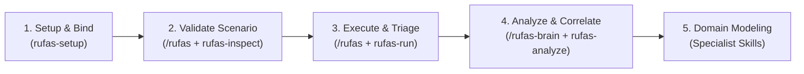

# RuFaS Agentic Tooling 🐄🌱

An agentic engineering companion, knowledge graph brain, and diagnostic toolkit for **RuFaS (Ruminant Farm Systems)** whole-farm dairy simulation modeling.

Built on the open [Agent Skills Specification](https://agentskills.io/specification), this project connects modern AI coding assistants (**Google Antigravity**, **Anthropic Claude Code**, **Universal Agent Skills**, **Cursor**, and **GitHub Copilot**) with the RuFaS modeling ecosystem.

---

## 💡 What is RuFaS Agentic Tooling?

**RuFaS** is a biophysical, whole-farm simulation model that simulates the intricate interactions of dairy systems: cow biology, crop growth, multi-layer soil hydrology, feed inventory, manure management, energy usage, and greenhouse gas (GHG) emissions.

Because RuFaS models complex real-world biophysical systems with dozens of modules and 22 required metadata configuration blobs, working with it can be challenging. **RuFaS Agentic Tooling** bridges this gap across three core pillars:

1. **Interactive Guide for Newcomers & Scientists**:  
   Demystifies the codebase. Acts as an interactive mentor that guides newcomers through setting up their first simulation, understanding how modules communicate, configuring scenario inputs, and interpreting results in plain language.
2. **Scientific & Research Intelligence**:  
   Helps researchers explore the *"why"* and *"what"*. Answers questions like *"What does parameter X do?"*, *"Why does this biological equation exist?"*, *"Which outputs are affected when I change input Y?"*, and discovers cross-run statistical correlations across the 2,038 output variables.
3. **Agentic Engineering & Diagnostic Guardrails**:  
   Equips AI assistants with deep domain context and deterministic verification tools (`rufas-inspect`, `rufas-run`, `rufas-analyze`, `rufas-brain`). This allows agents to validate schemas, run headless simulations, and modify code accurately without hallucinating parameters or violating physical mass balances.

---

## ⚡ Installation

Choose the setup that fits your workflow:

### Path A: AI Assistant Setup (Fastest)

If you already use an AI coding assistant and want to equip it with RuFaS specialist skills:

#### 1. Universal Agent Skills (`npx skills`)
Installs into universal standards-compliant agent directories (`~/.agents/skills`):
```bash
npx skills add thiago-f-santos/rufas-agentic-tooling
```

#### 2. Google Antigravity (`agy`)
Install as a plugin via the Python installer (establishes a live symlink to `~/.gemini/config/plugins/rufas-agentic-tooling`):
```bash
python -m tools.install_skills --runtime antigravity
```
*Or if you prefer CLI plugin management:*
```bash
agy plugin install thiago-f-santos/rufas-agentic-tooling
```

#### 3. Anthropic Claude Code (`claude`)
Inside your Claude Code session, add the repository as a plugin:
```text
/plugin marketplace add thiago-f-santos/rufas-agentic-tooling
/plugin install rufas-agentic-tooling
```
*Or symlink the skills directly into `~/.claude/skills/`:*
```bash
python -m tools.install_skills --runtime claude
```

#### 4. Cursor, GitHub Copilot, Windsurf & Gemini CLI
Symlink all specialist skills directly into your global agent directory (`~/.agents/skills/`):
```bash
python -m tools.install_skills --runtime universal
```

---

### Path B: Full Python Toolkit & Developer Setup

If you want the complete suite—including the command-line diagnostic tools (`rufas-inspect`, `rufas-run`, `rufas-analyze`), the interactive onboarding wizard (`rufas-setup`), and the KùzuDB graph memory brain (`rufas-brain`):

```bash
# 1. Clone this repository
git clone https://github.com/thiago-f-santos/rufas-agentic-tooling.git
cd rufas-agentic-tooling

# 2. Install package in editable mode
pip install -e .

# 3. Run the interactive onboarding wizard
rufas-setup
```

The `rufas-setup` wizard automatically:
- Locates your existing RuFaS repository (or clones the official repository for you if needed).
- Validates the directory structure and input metadata paths.
- Automatically deploys and symlinks the 7 specialist skills into all detected AI assistants.

---

## 🔄 How It Works: The Expected Workflow

The toolkit is designed around how scientists, modelers, and AI agents collaborate throughout a simulation lifecycle:



1. **Setup & Environment Binding**:  
   `rufas-setup` configures your RuFaS path once. All CLI tools and AI skills automatically discover the target codebase via a prioritized resolution hierarchy (CLI flag → environment variable → `.rufas.json` → global config → auto-detection).
2. **Scenario Inspection & Guidance**:  
   Before launching a run, ask the `/rufas` skill to check your scenario. Behind the scenes, the skill invokes `rufas-inspect` to ensure that all 22 required metadata blobs and cross-variable dependencies are valid before execution.
3. **Simulation Execution & Error Triage**:  
   Ask `/rufas` to run the simulation. Behind the scenes, `rufas-run` manages execution headlessly, capturing tracebacks, timeout issues, and logs cleanly without spamming your chat window. If a run fails, the agent diagnoses the exact failure point.
4. **Post-Run Analysis & Graph Memory**:  
   After execution, `rufas-analyze` parses output CSVs to summarize carbon, nitrogen, phosphorus, and water balances. The researcher or agent can then use `rufas-brain` (powered by an embedded KùzuDB graph) to query cross-run statistical correlations and trace causal relationships.
5. **Targeted Domain Modeling**:  
   Use domain specialist skills (`/rufas-animal`, `/rufas-field`, etc.) to understand why specific equations exist, ask how parameters interact, or implement modifications safely within that domain's biophysical boundaries.

### Why Do Skills Use Tools?
Language models are creative and articulate, but biophysical simulation requires mathematical precision and deterministic execution. By pairing each skill with dedicated diagnostic tools (`rufas-inspect`, `rufas-run`, `rufas-analyze`, `rufas-brain`), the AI agent grounds its answers in actual simulation code and data rather than relying on statistical guesswork.

---

## 🧠 The 7 Domain Specialist Skills

Each skill adheres to the open [Agent Skills Specification](https://agentskills.io/specification) and can be invoked on demand via slash commands or natural conversation.

| Skill | Domain Focus & Scope | Research & Modeling Questions Answered | Connected Tools |
| :--- | :--- | :--- | :--- |
| **`rufas`** | **Master Orchestration & Lifecycle** | • "How do I configure and run my first dairy scenario?"<br>• "Why did the simulation fail on day 120?"<br>• "Are my 22 scenario metadata blobs valid and complete?" | `rufas-inspect`<br>`rufas-run`<br>`rufas-analyze` |
| **`rufas-animal`** | **Herd Biology, Nutrition & Emissions** | • "What parameters drive lactation curves and milk yield?"<br>• "How does diet formulation affect enteric methane ($\text{CH}_4$)?"<br>• "Where do I configure herd demographics, parity, and culling rates?" | `rufas-inspect`<br>Ration Solvers<br>Animal Metadata |
| **`rufas-field`** | **Soils, Crops & Hydrology** | • "How does soil layer depth impact water drainage and nutrient runoff?"<br>• "Which inputs control crop growth stages, GDD, and harvest schedules?"<br>• "Why does nitrogen fertilization timing affect nitrate leaching?" | `rufas-inspect`<br>Weather Drivers<br>Field Metadata |
| **`rufas-feed`** | **Feed Storage, Spoilage & Inventory** | • "How does aerobic face spoilage reduce bunker silo dry matter?"<br>• "Why did the simulation run out of silage in month 8?"<br>• "Where are feed purchasing and inventory fulfillment rules set?" | `rufas-inspect`<br>Feed Storage Blobs |
| **`rufas-manure`** | **Manure Collection, Storage & Emissions** | • "How does solid-liquid separation or anaerobic digestion affect emissions?"<br>• "What factors control ammonia ($\text{NH}_3$) and methane ($\text{CH}_4$) losses in lagoons?"<br>• "How much recycled manure nitrogen is available for crop uptake?" | `rufas-inspect`<br>Manure Blobs<br>Emission Balances |
| **`rufas-eee`** | **Economics, Energy & Carbon Footprint** | • "What is the net carbon intensity (FPCM) of the farm under this scenario?"<br>• "How does tractor diesel fuel consumption scale with field acreage?"<br>• "What is the Income Over Feed Cost (IOFC) and Cost of Production?" | `rufas-inspect`<br>EEE Metadata<br>Scope 1-3 GHG |
| **`rufas-brain`** | **Graph Memory & Variable Encyclopedia** | • "What does variable `daily_methane_emissions` mean and what are its units?"<br>• "Which input parameters causally affect milk fat percentage?"<br>• "Is there a statistical correlation between dietary crude protein and N leaching?" | `rufas-brain`<br>KùzuDB Engine<br>Obsidian Vault |

---

## 📁 Repository Structure

```text
rufas-agentic-tooling/
├── AGENTS.md                          # Agent behavior guidelines & boundary rules
├── README.md                          # Project documentation & user guide
├── plugin.json                        # Antigravity plugin manifest
├── pyproject.toml                     # Python packaging & CLI console scripts
├── .claude-plugin/
│   └── plugin.json                    # Claude Code plugin manifest
├── data/                              # Graph database storage (rufas_brain.kuzu)
├── skills/                            # 7 Domain Specialist Skills (Agent Skills Spec)
│   ├── rufas/                         # Whole-system & simulation lifecycle orchestrator
│   ├── rufas-animal/                  # Herd biology, lactation & ration specialist
│   ├── rufas-field/                   # Soil hydrology, crops & biogeochemistry specialist
│   ├── rufas-feed/                    # Feed storage, spoilage & inventory specialist
│   ├── rufas-manure/                  # Manure management & gaseous emissions specialist
│   ├── rufas-eee/                     # Economics, energy & Scope 1-3 GHG specialist
│   └── rufas-brain/                   # Graph Memory Brain & Causal Ontology specialist
├── tools/                             # Core Python operational tools & CLI engines
│   ├── config.py                      # Multi-tier path resolution engine
│   ├── rufas_setup.py                 # Interactive onboarding wizard (`rufas-setup`)
│   ├── rufas_inspector.py             # Schema & metadata validator (`rufas-inspect`)
│   ├── rufas_runner.py                # Simulation execution runner (`rufas-run`)
│   ├── rufas_analyzer.py              # Biophysical metrics analyzer (`rufas-analyze`)
│   ├── rufas_brain.py                 # Graph Memory Brain & Cypher engine (`rufas-brain`)
│   └── install_skills.py              # Multi-runtime skill distributor (`rufas-install-skills`)
├── vault/                             # Generated Obsidian Knowledge Graph Vault
└── tests/                             # Test suite (unit, integration & manifest tests)
```

---

## 🧪 Verification & Testing

To run the link validation and plugin manifest tests:

```bash
# Verify skill links, markdown paths, and plugin manifests
PYTHONPATH=. pytest tests/test_links_lint.py tests/test_plugins_manifest.py

# Run the complete test suite
PYTHONPATH=. pytest
```
