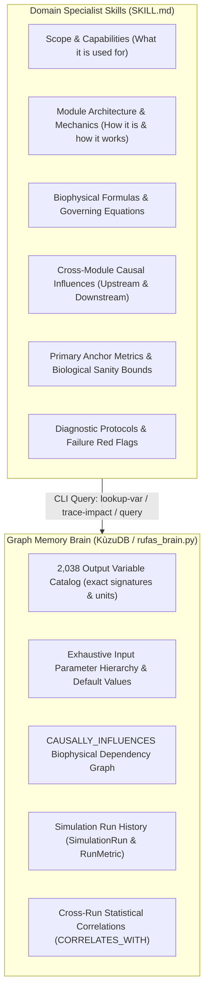

# Architecture Design: RuFaS Domain Specialists & Graph Memory Brain Tiering

**Date:** 2026-08-27  
**Status:** Approved for Implementation Planning  
**Scope:** Agentic Specialist Skills (`skills/rufas-*-specialist/`) and Graph Memory Brain (`tools/rufas_brain.py`)

---

## 1. Executive Summary & Problem Statement

### 1.1 Context
The RuFaS agentic tooling ecosystem uses specialized skills (`skills/rufas-animal-specialist`, `skills/rufas-field-soil-specialist`, `skills/rufas-manure-specialist`, `skills/rufas-feed-storage-specialist`, `skills/rufas-eee-specialist`, `skills/rufas-specialist`, `skills/rufas-brain-specialist`) to guide AI agents in configuring, analyzing, and diagnosing whole-farm biophysical simulations.

Historically, each domain specialist skill contained large static markdown tables cataloging hundreds of simulation output variable column names (over 2,000 variables across all modules). This created:
- **Excessive Token Consumption**: Skill markdown files grew to 15–25 KB (5,000+ tokens each), inflating prompt context windows on every load.
- **Maintenance Overhead**: Schema updates in the RuFaS simulation engine required manual synchronization across multiple skill files.
- **Underutilized Graph Database**: The KùzuDB Graph Memory Brain (`tools/rufas_brain.py`) already maintains the complete biophysical ontology, full 2,038 output variable signatures, input parameter mappings, and cross-run empirical metrics.

### 1.2 Objective
Transition to a **Tiered Hybrid Architecture**:
1. **Specialist Skills (`SKILL.md`)**: Act as the **domain reasoning engine**, retaining deep understanding of how their module works, biophysical governing formulas, cross-module upstream/downstream causal influences, primary diagnostic benchmark metrics, and troubleshooting red flags.
2. **Graph Memory Brain (`KùzuDB` / `rufas_brain.py`)**: Acts as the **exhaustive data repository and discovery engine**, serving all 2,038 exact variable signatures, units, parameter hierarchies, causal dependency traversal (`CAUSALLY_INFLUENCES`), and empirical cross-run statistics (`CORRELATES_WITH`, `RunMetric`).

---

## 2. System Architecture & Component Responsibilities



### 2.1 Responsibility Partitioning Matrix

| Domain Knowledge Element | Specialist Skill (`SKILL.md`) | Graph Brain (`KùzuDB`) |
|---|---|---|
| Module scope, purpose, and trigger conditions | ✅ **Primary** | ❌ None |
| Internal architecture & daily execution loop order | ✅ **Primary** | ❌ None |
| Biophysical governing equations & mathematical kinetics | ✅ **Primary** | ❌ None |
| Cross-module causal pathways (conceptual ripple effects) | ✅ **Primary** | 🔄 Structural Graph (`CAUSALLY_INFLUENCES`) |
| Primary anchor metrics & biological sanity ranges | ✅ **Primary** (5–10 per domain) | 🔄 Variable Nodes |
| Diagnostic error handling & troubleshooting heuristics | ✅ **Primary** | ❌ None |
| Exhaustive list of 2,038 output variable column signatures | ❌ Offloaded | ✅ **Primary** (`:OutputVariable`) |
| Exhaustive sub-field dictionary of JSON config schemas | ❌ Offloaded | ✅ **Primary** (`:InputParameter`) |
| Historical simulation metrics and run comparisons | ❌ Offloaded | ✅ **Primary** (`:RunMetric`, `:SimulationRun`) |
| Empirical cross-run statistical correlation matrices ($r, \rho, p$) | ❌ Offloaded | ✅ **Primary** (`:CORRELATES_WITH`) |

---

## 3. Standardized Domain Specialist Template

All domain specialist skills will be standardized to a lean, comprehensive 7-section template (~100–140 lines, ~1,200 tokens):

```markdown
---
name: rufas-<domain>-specialist
description: Use when analyzing, configuring, or debugging the RuFaS <Domain> module...
---

# RuFaS <Domain> Specialist Skill

## 1. Overview & Module Scope
- Role within whole-farm simulation.
- Interacting upstream and downstream managers.

## 2. Capabilities & When to Use
- Concrete triggering conditions, symptoms, and use cases.
- Negative routing (when to delegate to peer specialists or rufas-brain-specialist).

## 3. Module Architecture & Input Configuration Blobs
- Internal class hierarchy and execution sequence within daily loop.
- Summary table of primary scenario metadata blobs (Blob Key, Path, Key Parameters).

## 4. Core Biophysical Mechanics & Governing Formulas
- Mathematical equations, kinetics, digestion rates, mass balances, and optimization formulations.

## 5. Cross-Module Causal Influences & Whole-Farm Flow
- Upstream dependencies: data/mass received from other managers.
- Downstream causal impacts: data/mass streams delivered to other managers.
- Whole-farm feedback loops and parameter ripple effects.

## 6. Key Anchor Metrics & Biological Diagnostic Bounds
- Top 5–10 primary domain performance and health indicators:
  | Anchor Metric | Units | Diagnostic Benchmark | Anomaly Threshold & Root Cause |
  |---|---|---|---|

## 7. Dynamic Graph Brain Querying & Deep Variable Discovery
- Concrete CLI commands for querying the 2,038 variable catalog, tracing parameter pathways, and comparing run metrics via `tools/rufas_brain.py`.

## 8. Diagnostic Protocols & Red Flags
- Common failure modes, LP relaxation ladders, mass balance violations, and corrective protocols.
```

---

## 4. Subsystem Specifications

### 4.1 `rufas-animal-specialist`
- **Module Role**: Dairy cattle dynamics, herd demographics, nutritional metabolism, LP least-cost diet formulation, enteric $\text{CH}_4$, and excretion partitioning.
- **Key Equations**: Wood's gamma lactation curve ($Y(t) = a \cdot t^b \cdot e^{-c \cdot t}$), LP ration optimization subject to NRC/NASEM bounds, NASEM 2021 enteric $\text{CH}_4$ empirical kinetics.
- **Cross-Module Influences**:
  - *Upstream*: Consumes feed inventories and availability bounds from `FeedManager`.
  - *Downstream*: Streams daily `ManureStream` (feces, urine, N, P, K, VS, moisture) to `ManureManager`; passes feed purchases and milk yields to `EEEManager`.
- **Anchor Metrics**: DMI ($20.0–28.5\text{ kg DM/day}$), Milk Yield ($28.0–45.0\text{ kg/cow-day}$), Milk Fat ($3.50–4.20\%$), Enteric $\text{CH}_4$ ($350–550\text{ g/cow-day}$), NUE ($25–35\%$), Excreted TS ($12.0–15.0\%$).
- **Brain Query Integrations**: `lookup-var --name daily_milk_production`, `trace-impact --param lactation`, `trace-impact --param user_feeds`.

### 4.2 `rufas-field-soil-specialist`
- **Module Role**: Multi-layer soil water hydrology, carbon/nitrogen biogeochemistry (mineralization, immobilization, nitrification, denitrification), crop growth, and harvest scheduling.
- **Key Equations**: Darcy-Richards water flow, Century/DayCent-based soil organic matter turnover, Arrhenius temperature/moisture rate modifiers, crop transpiration and degree-day biomass accumulation.
- **Cross-Module Influences**:
  - *Upstream*: Consumes organic slurry/cake from `ManureManager` during application events; receives weather daily.
  - *Downstream*: Delivers harvested silage/grain crops to `FeedManager`; passes direct $\text{N}_2\text{O}$ and nitrate leaching to `EEEManager`.
- **Anchor Metrics**: Soil Nitrate ($\text{NO}_3\text{-N}$), Daily $\text{N}_2\text{O}$ emissions, Crop Yield ($\text{DM kg/ha}$), Soil Organic Carbon ($\text{SOC}\%$), Evapotranspiration ($\text{mm/day}$).
- **Brain Query Integrations**: `lookup-var --name N2O_emissions`, `trace-impact --param crop_configurations`, `trace-impact --param field_operation`.

### 4.3 `rufas-manure-specialist`
- **Module Role**: Barn housing collection, mechanical separation, liquid slurry storage basins, solid composting, anaerobic digestion, and gaseous emissions ($\text{CH}_4, \text{NH}_3, \text{N}_2\text{O}$).
- **Key Equations**: Van 't Hoff / Arrhenius dynamic MCF temperature response ($\text{MCF}(T) = \exp((E_a(T-T_{\text{ref}}))/(R T T_{\text{ref}}))$), CSTR anaerobic digestion methane yield ($\text{CH}_4 = \text{VS}_{\text{in}} \cdot B_0 \cdot \text{DestructionFraction}$), mass-transfer TAN volatilization.
- **Cross-Module Influences**:
  - *Upstream*: Receives pen-level `ManureStream` from `HerdManager`.
  - *Downstream*: Supplies requested organic nutrients to `FieldManager` during manure spreading events; passes fugitive barn and storage emissions to `EEEManager`.
- **Anchor Metrics**: Slurry Mass ($\text{kg/day}$), Slurry TS ($8–14\%$), Degradable VS ($\text{kg/day}$), Lagoon $\text{CH}_4$ ($\text{kg/day}$), Barn $\text{NH}_3\text{-N}$ ($\text{kg/day}$).
- **Brain Query Integrations**: `lookup-var --name housing_ammonia`, `trace-impact --param manure_management`, `trace-impact --param manure_processor_connection`.

### 4.4 `rufas-feed-storage-specialist`
- **Module Role**: Bunkers, silos, grain bins, and commodity shed inventory management; dynamic dry matter shrinkage, aerobic spoilage, effluent leachate, and purchase reconciliation.
- **Key Equations**: Bunk face dry matter deterioration kinetics as a function of packing density and ambient air exposure; inventory drawdown mass balances.
- **Cross-Module Influences**:
  - *Upstream*: Receives harvested forage/grain from `FieldManager`.
  - *Downstream*: Supplies feeds within inventory bounds to `HerdManager` for LP diet formulation; passes storage losses and commercial feed order volumes to `EEEManager`.
- **Anchor Metrics**: Bunker Shrinkage ($8–15\%$), Spoilage Loss ($\text{kg DM/day}$), Feed Inventory ($\text{kg DM}$), Feeding Drawdown Rate.
- **Brain Query Integrations**: `lookup-var --name storage_shrinkage`, `trace-impact --param feed_storage_configurations`, `trace-impact --param feed_storage_instances`.

### 4.5 `rufas-eee-specialist`
- **Module Role**: Farm economics (revenues, variable/fixed operating costs), energy use (diesel fuel, electricity), Scope 1/2/3 greenhouse gas accounting, and standardized carbon intensity ($kg\,\text{CO}_2e/kg\,\text{FPCM}$).
- **Key Equations**: 100-year GWP equivalents ($\text{GWP}_{\text{AR5}}$: $\text{CH}_4 = 28$, $\text{N}_2\text{O} = 265$), Fat and Protein Corrected Milk ($\text{FPCM} = \text{Milk} \times (0.1226 \times \text{Fat}\% + 0.0776 \times \text{Protein}\% + 0.2534)$), net farm profit calculations.
- **Cross-Module Influences**:
  - *Upstream*: Aggregates emissions, fuels, and costs across Animal, Field/Soil, Manure, and Feed Storage modules.
  - *Downstream*: Produces whole-farm sustainability and profitability reporting.
- **Anchor Metrics**: Farm Carbon Intensity ($0.85–1.35\text{ kg CO}_2\text{e/kg FPCM}$), Enterprise Net Return ($\$/\text{cwt}$), Total Scope 1 GHG ($\text{kg CO}_2\text{e/day}$), Diesel Consumption ($\text{L/ha}$).
- **Brain Query Integrations**: `lookup-var --name carbon_intensity`, `trace-impact --param EEE_constants`, `query "MATCH (p)-[r:CORRELATES_WITH]->(v:OutputVariable) WHERE v.category = 'emissions' RETURN p.id, v.name, r.pearson_r ORDER BY abs(r.pearson_r) DESC LIMIT 15"`.

### 4.6 `rufas-brain-specialist` & `rufas-specialist`
- **`rufas-specialist` (Master Skill)**: Orchestrates the overall simulation pipeline, metadata hierarchy, scenario execution, and delegates domain-specific inquiries to specialists.
- **`rufas-brain-specialist`**: Manages the KùzuDB graph database, OpenCypher query execution, correlation computation, parameter impact tracing, and Obsidian vault exports.

---

## 5. Graph Brain Discovery Interface

Domain specialists will query `tools/rufas_brain.py` using standardized CLI patterns:

```bash
# 1. Look up full variable column name, units, and reporter class by keyword
python -m tools.rufas_brain lookup-var --name <search_keyword>

# 2. Trace upstream parameter causal pathways and downstream variable impacts
python -m tools.rufas_brain trace-impact --param <parameter_name>

# 3. Execute custom OpenCypher queries on KùzuDB for cross-module traversal
python -m tools.rufas_brain query "MATCH (p:InputParameter)-[:CAUSALLY_INFLUENCES]->(v:OutputVariable) WHERE v.module = '<domain>' RETURN p.id, v.name, v.unit"

# 4. Ingest new simulation run and recompute correlations across historical runs
python -m tools.rufas_brain ingest --output-dir <output_dir> --run-id <run_id>
python -m tools.rufas_brain compute-correlations
```

---

## 6. Verification Plan & Success Criteria

1. **Token Reduction**: Each specialist skill file reduced from >15 KB down to ~5–7 KB (~70% reduction).
2. **Domain Rigor Preserved**: All specialists retain complete equations, cross-module influence explanations, primary anchor metrics with biological benchmarks, and diagnostic red flags.
3. **Seamless Tool Integration**: Commands `lookup-var`, `trace-impact`, and `query` in `tools/rufas_brain.py` verified working and validated against existing KùzuDB tests (`tests/test_brain.py`).
4. **All Tests Passing**: `pytest tests/` passing without regressions.
