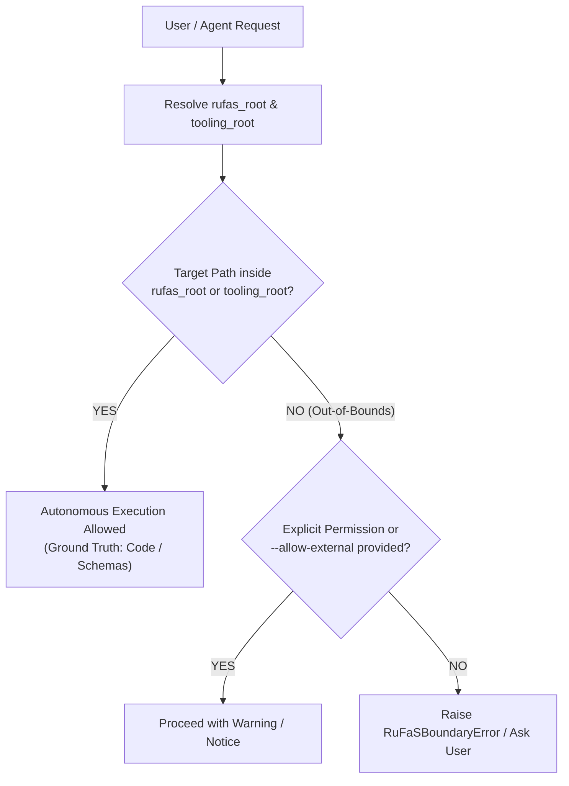

# RuFaS Boundary Containment Harness & Source of Truth Protocol Design

- **Status**: Proposed
- **Date**: 2026-09-01
- **Target Repository**: `rufas-agentic-tooling`
- **Related Skills**: `rufas`, `rufas-animal`, `rufas-field`, `rufas-feed`, `rufas-manure`, `rufas-eee`, `rufas-brain`

---

## 1. Problem Statement & Motivation

When AI coding assistants or automated agents are invoked in a parent directory containing multiple repositories (e.g. `/home/user/Projetos` or workspace root), agent tools (`grep_search`, `find_by_name`, `codegraph`, `view_file`, shell commands) may autonomously explore outside the target RuFaS codebase, querying unrelated files or sibling projects.

This violates two core principles:
1. **Source of Truth Integrity**: RuFaS domain questions must be answered using the RuFaS codebase itself (Python implementations, docstrings, schema files, and metadata) as the ground truth.
2. **Boundary Containment**: Autonomous exploration must be strictly confined to the RuFaS repository and `rufas-agentic-tooling`. Any interaction with files or systems outside this boundary requires explicit user authorization or agent confirmation.

---

## 2. Architectural Overview & Boundary Model

### 2.1 Allowed Roots
Operations and searches are strictly restricted to two canonical roots:
- **`rufas_root`**: The active RuFaS simulation repository (containing `RUFAS/`, `input/`, `docs/`, etc.), resolved via CLI flag, `RUFAS_PATH` / `RUFAS_ROOT`, local `.rufas.json`, or global `~/.rufas/config.json`.
- **`tooling_root`**: The `rufas-agentic-tooling` repository (containing `tools/`, `skills/`, `AGENTS.md`, etc.).

Any target path not rooted in one of these directories is classified as **Out-of-Bounds (OOB)**.



### 2.2 Source of Truth Hierarchy
When resolving domain logic, mathematical formulas, default parameters, or input formats:
1. **Tier 1 (Authoritative Implementation)**: Python source code under `<rufas_root>/RUFAS/` (classes, algorithms, equations, method docstrings).
2. **Tier 2 (Schema & Configuration Grounding)**: JSON schemas and cross-validation files under `<rufas_root>/input/metadata/` and `<rufas_root>/input/data/`.
3. **Tier 3 (Official Documentation)**: Markdown and reference guides in `<rufas_root>/docs/` and `rufas-agentic-tooling/skills/`.

---

## 3. Programmatic Kernel (`tools/boundary.py` & Tooling Hardening)

### 3.1 `tools/boundary.py` Module
A dedicated boundary enforcement module providing:
- **`RuFaSBoundaryError(Exception)`**: Informative exception explaining boundary violations and detailing corrective options.
- **`assert_within_rufas_scope(target_path, rufas_root=None, allow_external=False) -> Path`**: Canonicalizes the path via `Path.resolve()`, verifies membership in allowed roots, and raises `RuFaSBoundaryError` if unauthorized.
- **`get_allowed_roots(rufas_root=None) -> List[Path]`**: Retrieves canonical list `[rufas_root, tooling_root]`.
- **`is_path_in_scope(target_path, rufas_root=None) -> bool`**: Non-raising boolean predicate for fast filtering.

### 3.2 Integration into CLI Tools
- **`tools/config.py`**: Exports boundary validation utilities and integrates them into `get_rufas_root`.
- **`tools/rufas_inspector.py`, `tools/rufas_analyzer.py`, `tools/rufas_runner.py`, `tools/rufas_brain.py`**:
  - Validates all input file paths, scenario paths, and output target directories against `assert_within_rufas_scope`.
  - Introduces a CLI flag `--allow-external` for explicit user override when processing external datasets.

---

## 4. Skill & Agent Directives Protocol

### 4.1 Standardized Protocol Block in All 7 Skills
Each of the 7 skill files (`skills/rufas/SKILL.md`, `skills/rufas-animal/SKILL.md`, `skills/rufas-field/SKILL.md`, `skills/rufas-feed/SKILL.md`, `skills/rufas-manure/SKILL.md`, `skills/rufas-eee/SKILL.md`, `skills/rufas-brain/SKILL.md`) will include the following standardized block:

```markdown
## RuFaS Boundary & Source of Truth Protocol

> [!IMPORTANT]
> **Boundary Containment & Ground Truth Rules:**
> 1. **Autonomous Search Scope**: All autonomous file searches (`grep_search`, `find_by_name`, `codegraph_explore`, shell commands) MUST explicitly set `SearchPath` / `SearchDirectory` / `Cwd` to `<rufas_root>` or `<tooling_root>`. NEVER run unscoped searches across parent or sibling directories.
> 2. **Source of Truth Hierarchy**: When explaining mechanics, equations, or defaults, ground answers directly in `<rufas_root>/RUFAS/` Python code and `<rufas_root>/input/metadata/` schemas.
> 3. **Explicit External Confirmation Gate**: If an investigation requires reading files or repositories outside `<rufas_root>` / `<tooling_root>`, the agent MUST halt autonomous search and ask the user for explicit confirmation before proceeding.
> 4. **Subagent Delegation**: Any subagent spawned via `invoke_subagent` MUST explicitly receive the resolved `<rufas_root>` path and these boundary constraints in its prompt.
```

### 4.2 Repository Directives (`AGENTS.md`)
Update [AGENTS.md](file:///home/thiago/Projetos/rufas-agentic-tooling/AGENTS.md) with explicit rules on:
- Strict containment of autonomous file exploration to `RuFaS` and `rufas-agentic-tooling`.
- Explicit user confirmation requirement for any out-of-scope interactions.
- Context propagation to subagents.

### 4.3 Skill Synchronization
Run `tools/install_skills.py` to synchronize updated skills across runtime directories (`~/.gemini/config/plugins/`, `~/.claude/skills/`, `~/.agents/skills/`).

---

## 5. Testing & Quality Assurance

1. **Unit Tests (`tests/test_boundary.py`)**:
   - Verification of allowed paths inside `rufas_root` and `tooling_root`.
   - Verification of out-of-bounds paths triggering `RuFaSBoundaryError`.
   - Prevention of directory traversal attacks (`../` paths escaping the root).
   - Behavior with `allow_external=True`.
2. **CLI Integration Tests**:
   - Test `rufas-inspect` and `rufas-analyze` handling valid vs invalid paths and `--allow-external` flag.
3. **Skill Compliance Tests (`tests/test_skills_compliance.py`)**:
   - Automated test checking all 7 `SKILL.md` files for presence of the `RuFaS Boundary & Source of Truth Protocol` section and valid links.
