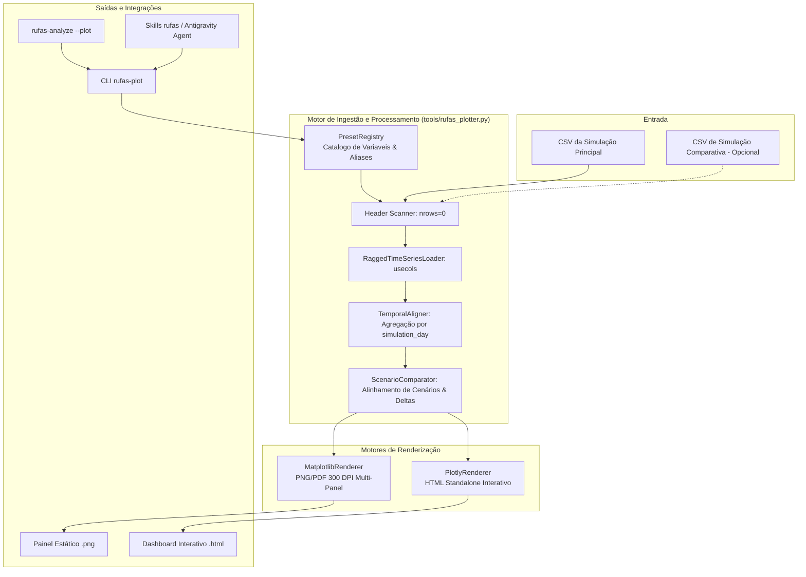

# Especificação Técnica: Ferramenta de Visualização e Plotagem de Simulações RuFaS (`rufas-plot`)

**Data:** 21 de Setembro de 2026  
**Status:** Aprovado em Brainstorming  
**Tipo:** Arquitetural (Design Spec)  
**Alvo:** `rufas-agentic-tooling/tools/rufas_plotter.py`, `tools/rufas_analyzer.py`, `pyproject.toml`, `skills/rufas/SKILL.md`  

---

## 1. Visão Geral e Motivação

As simulações biofísicas e econômicas do **RuFaS (Ruminant Farm Systems)** produzem arquivos tabulares de saída volumosos e complexos (ex.: CSVs com ~1.990 variáveis e até mais de 73.000 linhas, totalizando 140+ MB para um biênio). 

Além do volume, os dados de saída são intrinsecamente **irregulares (*ragged*)**:
- Variáveis de fazenda (clima, balanço global de nutrientes) são registradas 1 vez por dia.
- Variáveis zootécnicas individuais (produção de leite de vacas) são registradas por animal ou lote (~100 linhas por dia com coluna própria de `simulation_day`).
- Condições iniciais e parâmetros estruturais ocupam apenas a linha inicial (dia 0).

Atualmente, o `rufas-agentic-tooling` oferece análises textuais via `rufas_analyzer.py` e consultas em grafo via `rufas_brain.py`, mas carece de uma **ferramenta dedicada de visualização gráfica da fazenda como um todo**.

### Objetivos Principais
1. **Visão Holística 360° (*Whole-Farm Overview*):** Gerar painel integrado consolidando os 5 pilares do RuFaS: Rebanho/Zootecnia, Nutrição/Alimentação, Lavoura/Solos, Dejetos/Manejo e EEE (Emissões, Energia e Economia).
2. **Ingestão Otimizada de Alta Performance:** Nunca carregar o arquivo CSV inteiro na memória. Inspecionar o cabeçalho (`nrows=0`), selecionar apenas as colunas estritamente necessárias (`usecols` no pandas) e gerar gráficos em 1 a 2 segundos.
3. **Mecanismo de Alinhamento de Séries *Ragged*:** Reamostrar e agregar automaticamente variáveis de vaca, lote e talhão para uma grade diária uniforme indexada por `simulation_day` e datas de calendário.
4. **Renderização Dupla (Estática + Interativa):**
   - **PNG/PDF em 300 DPI** via Matplotlib para relatórios técnicos, chat com agentes e documentação.
   - **HTML Autônomo e Interativo** via Plotly com eixos temporais sincronizados, tooltips ricas e *range slider*.
5. **Comparação Direta de Cenários:** Capacidade nativa de sobrepor rodadas (*Baseline* vs *Intervenção A/B*) e calcular deltas absolutos e percentuais ($\Delta\%$).
6. **Integração de Primeira Classe no Ecossistema:** Comando CLI `rufas-plot`, flag de atalho `rufas-analyze --plot`, API Python para subagentes e documentação na skill `rufas`.

---

## 2. Arquitetura do Sistema e Componentes



### 2.1 Descrição dos Componentes

1. **`PresetRegistry`:**
   - Dicionário canônico mapeando cada preset (`executive`, `animal`, `eee`, `field-crops`, `manure`) para padrões de nomes de variáveis do RuFaS.
   - Fornece busca resiliente por *regex* e *fallback aliases* (ex.: suporta variações entre simulações com ou sem agrupamento de pens).

2. **`RaggedTimeSeriesLoader`:**
   - Executa leitura do cabeçalho para identificar as colunas presentes.
   - Carrega unicamente as colunas mapeadas utilizando `pd.read_csv(filepath, usecols=resolved_cols, low_memory=False)`.

3. **`TemporalAligner`:**
   - Agrupa variáveis registradas em nível de entidade individual (ex.: `report_milk.milk_data_at_milk_update.cow_id` e `estimated_daily_milk_produced`) pelo seu respectivo `simulation_day`:
     - Produção total da fazenda: `sum()`.
     - Produtividade média por vaca: `mean()`.
   - Agrupa emissões ou consumos divididos por baias/piquetes (ex.: `CALF_PEN_*_manure_mass`) somando os valores por dia.
   - Mescla todas as variáveis alinhadas em um `pd.DataFrame` canônico indexado por `simulation_day` ($0, 1, 2, \dots, T-1$), associado a `RufasTime.calendar_year` e `RufasTime.day` (Julian day).
   - Calcula médias móveis configuráveis (janela padrão: 30 dias) para suavização de tendências.

4. **`ScenarioComparator`:**
   - Quando ativado via `--compare <caminho_2>`, ingere e normaliza ambas as simulações.
   - Alinha os índices temporais relativos (`simulation_day`).
   - Calcula séries de delta absoluto ($\Delta = S_{\text{cenário}} - S_{\text{baseline}}$) e variação percentual:
     $$\Delta\% = \frac{S_{\text{cenário}} - S_{\text{baseline}}}{S_{\text{baseline}}} \times 100$$
   - Computa métricas anuais agregadas (médias e somatórios totais) para tabela executiva comparativa.

5. **`MatplotlibRenderer`:**
   - Gera gráficos estáticos em alta definição (300 DPI) com layout padronizado de publicação científica.
   - Aplica paleta semântica: azul (leite/água), verde (lavoura/biomassa), laranja/vermelho (emissões de carbono/GEE), roxo (rebanho).
   - Suporte a linhas de média móvel com bandas de dispersão diária semitransparentes.

6. **`PlotlyRenderer`:**
   - Constrói figuras com subplots compartilhando o eixo X (`shared_xaxes=True`).
   - Insere *Range Slider* temporal na base para filtragem de anos/estações.
   - Exporta HTML autossuficiente com `include_plotlyjs=True` (execução offline sem dependência de servidor web).

---

## 3. Taxonomia dos Presets de Visualização

### 3.1 Preset `executive` (Whole-Farm 360° Dashboard)
Composto por **6 painéis sincronizados** dispostos em grid 3x2:
1. **Produção de Leite:** Produção total diária da fazenda ($\text{kg/dia}$) e produtividade média ($\text{kg/vaca/dia}$) com média móvel de 30 dias.
2. **Dinâmica do Rebanho:** Série temporal empilhada ou em linhas com contagem de vacas em lactação, vacas secas, novilhas e bezerras.
3. **Emissões de GEE da Fazenda:** Metano entérico diário ($\text{kg CH}_4/\text{dia}$) e emissões de carbono do solo/dejetos ($\text{kg CO}_2\text{e/dia}$).
4. **Excreção Diária de Dejetos:** Volume/massa diária de esterco gerado pelas instalações ($\text{kg esterco úmido/dia}$).
5. **Consumo e Custos de Ração:** Custo diário de alimentação comprada ($\text{USD/dia}$) e consumo total de matéria seca (DMI).
6. **Hidrologia da Lavoura / Uso da Terra:** Transpiração e evapotranspiração acumulada do solo ($\text{mm/dia}$).

### 3.2 Presets Modulares Especializados

- **`animal` (Grid 2x2):**
  - Painel 1: Curva de produção de leite total e por vaca.
  - Painel 2: Teores de sólidos (gordura, proteína e lactose em kg/dia).
  - Painel 3: Dias em Lactação (DIM) médios e dias de gestação.
  - Painel 4: População de categorias de reposição e descarte.
- **`eee` (Grid 2x2):**
  - Painel 1: Partição de emissões de GEE por fonte (entérica vs dejetos vs solo).
  - Painel 2: Intensidade de carbono estimada ($\text{kg CO}_2\text{e / kg leite FPCM}$).
  - Painel 3: Custos de rações compradas por categoria de ingrediente.
  - Painel 4: Consumo e custos energéticos operacionais.
- **`field-crops` (Grid 2x2):**
  - Painel 1: Transpiração real vs potencial da cultura ($\text{mm}$).
  - Painel 2: Emissões de óxido nitroso ($\text{N}_2\text{O}$) e carbono do solo por camada.
  - Painel 3: Aplicação de dejetos na lavoura (massa e cobertura de solo).
  - Painel 4: Dinâmica hídrica e drenagem do perfil de solo.
- **`manure` (Grid 2x2):**
  - Painel 1: Excreção diária de massa de dejetos por instalação.
  - Painel 2: Excreção e concentração de nitrogênio e fósforo.
  - Painel 3: Perdas gasosas e volatilização no armazenamento/lagoa.
  - Painel 4: Volume e matéria seca transferidos para aplicação agronômica.
- **`custom` (Grid Dinâmico):**
  - Ativado quando o usuário fornece `--vars "regex_ou_coluna1,coluna2"`.
  - Resolve as colunas solicitadas, alinha no tempo e plota em grid proporcional ao número de variáveis.

---

## 4. Comparação de Cenários (A/B Testing)

Quando acionado com o argumento `--compare <caminho_cenario_2> [caminho_cenario_3 ...]`:
1. **Curvas Sobrepostas:**
   - *Baseline:* Linha sólida azul/escura contínua com espessura destacada.
   - *Cenário 1:* Linha tracejada vermelha/laranja.
   - *Cenário 2:* Linha pontilhada verde.
2. **Subplot de Delta Percentual ($\Delta\%$):**
   - Para cada painel principal, renderiza um subgráfico inferior exibindo a diferença percentual diária em relação ao baseline, facilitando a identificação imediata de reduções de emissão ou ganhos zootécnicos.
3. **Resumo Executivo Tabular:**
   - Gera um sumário impresso no terminal e inserido como tabela no HTML com os valores médios anuais e a variação líquida consolidada.

---

## 5. Interface de Linha de Comando e API Python

### 5.1 Especificação da CLI (`rufas-plot`)

```text
Uso: rufas-plot [OPÇÕES] [CAMINHO_DO_CSV_OU_DIRETORIO_DE_SAIDA]

Argumentos:
  input_path               Caminho para o CSV de saída ou diretório output do RuFaS.
                           Se omitido, detecta o último CSV gerado em RuFaS/output/CSVs/.

Opções:
  -p, --preset [executive|animal|eee|field-crops|manure|all]
                           Preset de visualização a gerar (Padrão: executive).
  -v, --vars TEXT          Lista de colunas/regex customizadas para plotar (Modo custom).
  -f, --format [both|png|html]
                           Formato de exportação (Padrão: both).
  -c, --compare PATH ...   Um ou mais caminhos de CSVs de cenários para comparação.
  -o, --output-dir PATH    Diretório de destino dos gráficos (Padrão: <input>/plots/).
  -w, --rolling-window INT Janela em dias para cálculo da média móvel (Padrão: 30).
  --dpi INT                Resolução das imagens estáticas (Padrão: 300).
  --title TEXT             Título customizado do painel.
  -h, --help               Exibe esta mensagem de ajuda.
```

### 5.2 Hook no `rufas_analyzer.py`
Adicionar flag `--plot` na CLI do analisador:
```bash
rufas-analyze RuFaS/output/ --plot
```
Quando presente, invoca programmaticamente `generate_plots(output_dir, preset='executive')` após a impressão do relatório de texto.

### 5.3 Assinatura da API Python
```python
def generate_plots(
    input_path: Union[str, Path],
    preset: str = "executive",
    custom_vars: Optional[List[str]] = None,
    output_format: str = "both",
    compare_paths: Optional[List[Union[str, Path]]] = None,
    output_dir: Optional[Union[str, Path]] = None,
    rolling_window: int = 30,
    dpi: int = 300,
    title: Optional[str] = None,
) -> Dict[str, Any]:
    """
    Gera painéis estáticos e/ou interativos a partir de simulações do RuFaS.
    Retorna dicionário contendo o status da execução e os caminhos dos arquivos gerados:
    {
        "status": "success",
        "preset": "executive",
        "artifacts": {
            "png": ["/path/to/output/plots/executive_dashboard.png"],
            "html": ["/path/to/output/plots/executive_dashboard.html"]
        },
        "metrics_summary": { ... }
    }
    """
```

---

## 6. Tratamento de Erros e Proteções de Escopo

1. **Restrição de Limite RuFaS:** Validação de todos os caminhos fornecidos (`input_path`, `compare_paths`, `output_dir`) via `assert_within_rufas_scope(path, allow_external=False)` para prevenir travessia indevida de diretórios.
2. **Tolerância a Módulos Inativos:** Se um módulo de biologia não tiver sido executado na simulação (ex.: sem culturas de lavoura configuradas), o painel correspondente não quebra a execução; exibe uma mensagem informativa no subplot: *"Módulo 'field' não configurado nesta simulação"*.
3. **Resiliência a Nomes de Colunas:** Uso de busca com suporte a prefixos alternativos e identificadores de pen/talhão dinâmicos.
4. **Validação de CSV Vazio ou Incompleto:** Detecção antecipada de arquivos vazios ou simulações abortadas antes da renderização.

---

## 7. Dependências e Configuração do Projeto

1. **`pyproject.toml`:**
   - Adicionar `plotly>=5.0.0` à lista `dependencies`.
   - Adicionar script de console:
     ```toml
     [project.scripts]
     rufas-plot = "tools.rufas_plotter:main"
     ```
2. **Ambiente Virtual:**
   - Instalar `plotly` no ambiente virtual (`./venv/bin/pip install plotly`).

---

## 8. Plano de Testes Automatizados

O arquivo de testes será criado em [`tests/test_rufas_plotter.py`](file:///home/thiago/Projects/rufas-agentic-tooling/tests/test_rufas_plotter.py) contendo a seguinte suíte:

1. **Testes Unitários:**
   - `test_resolve_columns_executive`: Garante que o registry resolve colunas existentes em simulações canônicas do RuFaS.
   - `test_ragged_alignment`: Valida o agrupamento por `simulation_day` de dados mistos (vaca vs dia global) gerando índices uniformes.
   - `test_rolling_averages`: Verifica cálculo correto da média móvel e preenchimento de bordas.
   - `test_scenario_delta_calculation`: Valida se $\Delta$ e $\Delta\%$ são calculados com precisão matemática.
   - `test_missing_module_handling`: Garante que a ausência de um módulo opcional gera aviso amigável sem lançar exceção.

2. **Testes de Integração:**
   - `test_generate_plots_png_and_html`: Executa a função `generate_plots` em uma simulação sintética e na saída real de Minas Gerais, validando se ambos os arquivos (`.png` e `.html`) são gerados e têm tamanho $> 0$.
   - `test_png_image_validity`: Abre a imagem gerada com a biblioteca Pillow para certificar integridade estrutural e dimensões.
   - `test_html_content_validity`: Inspeciona o arquivo HTML gerado para garantir a presença dos scripts do Plotly e dos dados incorporados.
   - `test_cli_execution`: Invoca o CLI `rufas-plot` via `subprocess` ou `CliRunner` validando argumentos `--preset`, `--format`, `--compare` e código de saída 0.
