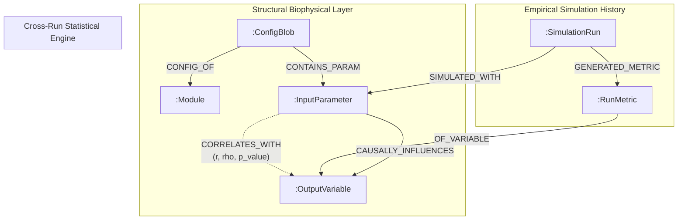

# RuFaS Graph Memory Brain Specialist Skill

## Overview

The **RuFaS Graph Memory Brain & Correlation Engine** (`tools/rufas_brain.py`) is an embedded property graph system built on **KùzuDB** (`kuzu`). It unifies the entire RuFaS simulation ecosystem by connecting:
1. **Structural Biophysical Ontology**: 5 Canonical Modules, 22 Configuration Blobs, Input Parameters, 2,038 Output Variables, and domain `CAUSALLY_INFLUENCES` pathways.
2. **Empirical Simulation History**: `:SimulationRun` records connected to `:RunMetric` time-series summary statistics and `SIMULATED_WITH` input values.
3. **Statistical Correlation Engine**: Pearson $r$, Spearman $\rho$, and two-tailed $p$-values computed across runs to establish `:CORRELATES_WITH` edges.
4. **On-Demand Knowledge Graph Exporter**: Generation of fully linked Obsidian Markdown vaults with YAML frontmatter and Dataview DQL queries.

This skill equips agents to perform graph traversal, parameter impact tracing, cross-run statistical inference, variable catalog lookups, and OpenCypher queries.

---

## When to Use

### Triggering Conditions & Symptoms
- Querying input parameters and discovering biophysical causal pathways (`CAUSALLY_INFLUENCES`).
- Discovering empirical statistical correlations (`CORRELATES_WITH`) between farm inputs and simulation outputs.
- Looking up variable definitions, units, functional categories, and reporter classes across the 2,038 variable catalog.
- Executing custom OpenCypher queries on KùzuDB to analyze whole-farm simulations.
- Tracing multi-module interactions (e.g. how herd feed intake propagates through manure lagoons to field soil $\text{N}_2\text{O}$ emissions and farm carbon intensity).
- Comparing output metrics across historical simulation runs.
- Exporting or updating an interactive Obsidian Markdown knowledge graph vault.

### When NOT to Use
- Single-run execution without graph querying (use [`rufas-specialist`](file:///home/thiago/Projetos/rufas-agentic-tooling/skills/rufas-specialist/SKILL.md)).
- In-depth biophysical equation tuning within a single domain (delegate to [`rufas-animal-specialist`](file:///home/thiago/Projetos/rufas-agentic-tooling/skills/rufas-animal-specialist/SKILL.md), [`rufas-field-soil-specialist`](file:///home/thiago/Projetos/rufas-agentic-tooling/skills/rufas-field-soil-specialist/SKILL.md), [`rufas-feed-storage-specialist`](file:///home/thiago/Projetos/rufas-agentic-tooling/skills/rufas-feed-storage-specialist/SKILL.md), [`rufas-manure-specialist`](file:///home/thiago/Projetos/rufas-agentic-tooling/skills/rufas-manure-specialist/SKILL.md), or [`rufas-eee-specialist`](file:///home/thiago/Projetos/rufas-agentic-tooling/skills/rufas-eee-specialist/SKILL.md)).

---

## Core Architecture & Graph Schema

The Graph Memory Brain stores a dual-layer property graph in KùzuDB:



### Node Tables

| Node Table | Primary Key | Key Properties | Description |
|---|---|---|---|
| `:Module` | `name` (`STRING`) | `description`, `manager_class` | Canonical subsystems: `animal`, `field_soil`, `feed_storage`, `manure`, `eee`. |
| `:ConfigBlob` | `name` (`STRING`) | `title`, `file_path`, `description`, `format_type` | The 22 required scenario configuration files. |
| `:InputParameter` | `id` (`STRING`) | `blob_name`, `param_name`, `data_type`, `unit`, `default_value`, `description` | Fine-grained configuration parameters (e.g. `animal.mature_body_weight`). |
| `:OutputVariable` | `name` (`STRING`) | `module`, `unit`, `category`, `reporter_class`, `description` | All 2,038 time-series output variables cataloged by RuFaS. |
| `:SimulationRun` | `run_id` (`STRING`) | `scenario_name`, `execution_date`, `start_date`, `end_date`, `duration_days`, `random_seed`, `status` | Executed whole-farm simulation metadata. |
| `:RunMetric` | `id` (`STRING`) | `run_id`, `var_name`, `mean_val`, `min_val`, `max_val`, `sum_val`, `non_null_count` | Aggregated statistical summaries for a variable within a run. |

### Relationship Tables

| Relationship | Source Node | Target Node | Properties | Semantics |
|---|---|---|---|---|
| `CONFIG_OF` | `ConfigBlob` | `Module` | None | Maps configuration files to owning subsystems. |
| `CONTAINS_PARAM` | `ConfigBlob` | `InputParameter` | None | Structural containment of configuration parameters. |
| `CAUSALLY_INFLUENCES` | `InputParameter` | `OutputVariable` | `pathway`, `mechanism` | Direct biophysical cause-and-effect relationship. |
| `SIMULATED_WITH` | `SimulationRun` | `InputParameter` | `value` | Parameter values applied during a specific simulation run. |
| `GENERATED_METRIC` | `SimulationRun` | `RunMetric` | None | Links simulation execution to its metric observations. |
| `OF_VARIABLE` | `RunMetric` | `OutputVariable` | None | Grounding of calculated metric to canonical variable catalog. |
| `CORRELATES_WITH` | `InputParameter` | `OutputVariable` | `pearson_r`, `spearman_r`, `p_value`, `sample_size` | Statistically significant empirical correlation across runs. |

---

## Practical OpenCypher Query Templates

### 1. Top Drivers of Greenhouse Gas Emissions
Discover all input parameters that causally influence or empirically correlate with methane ($\text{CH}_4$), nitrous oxide ($\text{N}_2\text{O}$), or total GHG footprint:

```cypher
MATCH (p:InputParameter)-[r:CORRELATES_WITH]->(v:OutputVariable)
WHERE v.category = 'emissions' OR lower(v.name) CONTAINS 'methane' OR lower(v.name) CONTAINS 'n2o'
RETURN p.id AS Parameter, v.name AS Output_Variable, r.pearson_r AS Pearson_r, r.p_value AS p_value, r.sample_size AS Sample_Size
ORDER BY abs(r.pearson_r) DESC
LIMIT 20;
```

### 2. Tracing Biophysical Causal Pathways for a Parameter
Find all biophysical mechanisms and downstream output variables affected when modifying a specific parameter:

```cypher
MATCH (p:InputParameter {id: 'animal.mature_body_weight'})-[c:CAUSALLY_INFLUENCES]->(v:OutputVariable)
RETURN v.module AS Module, v.name AS Output_Variable, v.unit AS Unit, c.pathway AS Pathway, c.mechanism AS Mechanism
ORDER BY v.module, v.name;
```

### 3. Cross-Run Metric Comparison
Compare production and emission metrics between multiple simulation runs (e.g. baseline vs mitigation scenario):

```cypher
MATCH (r:SimulationRun)-[:GENERATED_METRIC]->(rm:RunMetric)-[:OF_VARIABLE]->(v:OutputVariable)
WHERE v.name IN [
    'AnimalModuleReporter.report_herd_statistics_data.daily_milk_production (kg/day)',
    'AnimalModuleReporter.report_enteric_methane_emission.enteric_methane_emission_for_LAC_COW_PEN_3 (g)',
    'FieldDataReporter.send_soil_daily_variables.N2O_emissions.field=\'field_1\' (kg N/ha)'
]
RETURN r.run_id AS Run, r.scenario_name AS Scenario, v.name AS Metric, rm.mean_val AS Mean, rm.sum_val AS Total
ORDER BY v.name, r.run_id;
```

### 4. Feed-to-Manure-to-Soil Cross-Module Pathway
Inspect variables connecting feed storage, animal excretion, manure handling, and field soil application:

```cypher
MATCH (v:OutputVariable)
WHERE v.module IN ['animal', 'manure', 'field_soil']
  AND (lower(v.name) CONTAINS 'nitrogen' OR lower(v.name) CONTAINS 'manure_mass' OR lower(v.name) CONTAINS 'urea')
RETURN v.module AS Module, v.reporter_class AS Reporter, v.name AS Variable_Name, v.unit AS Unit
ORDER BY v.module, v.name
LIMIT 30;
```

### 5. Variable Catalog Lookup by Module & Category
Search available variables within a subsystem and functional category:

```cypher
MATCH (v:OutputVariable {module: 'manure', category: 'emissions'})
RETURN v.name AS Variable, v.unit AS Unit, v.reporter_class AS Reporter_Class, v.description AS Description
ORDER BY v.name;
```

---

## CLI Command Reference

The Graph Memory Brain is operated via `tools/rufas_brain.py` (or the CLI command `rufas-brain`):

```bash
# 1. Initialize KùzuDB brain and populate biophysical ontology
python -m tools.rufas_brain init --db-path data/rufas_brain.kuzu --rufas-root ../RuFaS

# 2. Ingest a simulation run from CSV output directory
python -m tools.rufas_brain ingest --output-dir ../RuFaS/output --run-id freestall_baseline --scenario example_freestall

# 3. Compute statistical correlations across all ingested runs
python -m tools.rufas_brain compute-correlations --min-r 0.5 --max-p 0.05 --min-samples 3

# 4. Execute an OpenCypher query (formatted table or JSON)
python -m tools.rufas_brain query "MATCH (m:Module) RETURN m.name, m.manager_class"
python -m tools.rufas_brain query "MATCH (p:InputParameter)-[r:CORRELATES_WITH]->(v:OutputVariable) RETURN p.id, v.name, r.pearson_r LIMIT 10" --json

# 5. Trace parameter causal pathways and statistical impacts
python -m tools.rufas_brain trace-impact --param cow_num
python -m tools.rufas_brain trace-impact --param mature_body_weight --json

# 6. Lookup output variable metadata, drivers, and latest run metrics
python -m tools.rufas_brain lookup-var --name daily_milk_production
python -m tools.rufas_brain lookup-var --name enteric_methane --json

# 7. Export Obsidian Markdown knowledge graph vault
python -m tools.rufas_brain export-obsidian --output-dir vault/
```

---

## Domain Specialist Skill Integration Guidelines

Domain specialist skills should delegate cross-module inquiries, parameter impact tracing, and variable lookups to the `rufas-brain-specialist`:

| Specialist Skill | Graph Brain Query / Delegation Use Case | OpenCypher Pattern / CLI Command |
|---|---|---|
| [`rufas-animal-specialist`](file:///home/thiago/Projetos/rufas-agentic-tooling/skills/rufas-animal-specialist/SKILL.md) | Discover how dietary DMI and lactation curve changes affect manure solids and lagoon emissions. | `python -m tools.rufas_brain trace-impact --param lactation` |
| [`rufas-field-soil-specialist`](file:///home/thiago/Projetos/rufas-agentic-tooling/skills/rufas-field-soil-specialist/SKILL.md) | Cross-reference fertilizer schedules against soil carbon pools, nitrate leaching, and $\text{N}_2\text{O}$ emissions. | `python -m tools.rufas_brain trace-impact --param fertilizer_schedule` |
| [`rufas-feed-storage-specialist`](file:///home/thiago/Projetos/rufas-agentic-tooling/skills/rufas-feed-storage-specialist/SKILL.md) | Trace storage shrinkage and spoilage impacts on purchased feed expenses and Scope 3 emissions. | `python -m tools.rufas_brain trace-impact --param feed_storage_configurations` |
| [`rufas-manure-specialist`](file:///home/thiago/Projetos/rufas-agentic-tooling/skills/rufas-manure-specialist/SKILL.md) | Correlate anaerobic digester efficiency and separator settings with whole-farm GHG footprint. | `python -m tools.rufas_brain trace-impact --param manure_management` |
| [`rufas-eee-specialist`](file:///home/thiago/Projetos/rufas-agentic-tooling/skills/rufas-eee-specialist/SKILL.md) | Trace whole-farm carbon intensity ($kg\,\text{CO}_2e/kg\,\text{FPCM}$) drivers across animal, soil, and manure modules. | `MATCH (p)-[r:CORRELATES_WITH]->(v:OutputVariable) WHERE v.name CONTAINS 'carbon_intensity' RETURN p, r` |

---

## Obsidian Knowledge Vault Structure

When exported (`export-obsidian`), the generated Obsidian vault includes:

```
vault/
├── 00_Dashboard.md                     # Central system dashboard with Dataview DQL queries
├── 01_Simulations/                     # Note per simulation run with parameter values & metrics
│   ├── freestall_baseline.md
│   └── freestall_mitigation_01.md
├── 02_Parameters/                      # Parameter dictionary with defaults & causal links
│   ├── animal_mature_body_weight.md
│   └── config_cow_num.md
├── 03_Outputs/                         # 2,038 output variable notes with units & drivers
│   ├── AnimalModuleReporter_..._daily_milk_production.md
│   └── FieldDataReporter_..._N2O_emissions.md
├── 04_Correlations/                    # Empirical statistical correlation tables
│   └── Significant_Correlations.md
└── 05_Modules/                         # 5 Canonical subsystem overviews
    ├── Animal_Module.md
    ├── Field_Soil_Module.md
    ├── Feed_Storage_Module.md
    ├── Manure_Module.md
    └── EEE_Module.md
```

All notes contain valid YAML frontmatter and bi-directional `[[wikilinks]]` for graph view exploration.

---

## Red Flags & Rationalization Table

| Rationalization / Mistake | Reality & Correct Protocol |
|---|---|
| *"I can infer parameter impacts by guessing variable names."* | RuFaS output names follow strict signatures (`Class.method.variable.context (unit)`). Use `lookup-var` or OpenCypher to find exact variable names and units. |
| *"Statistical correlation implies direct biophysical causation."* | `:CORRELATES_WITH` indicates empirical co-variance across runs ($r, p$). Always cross-check with `:CAUSALLY_INFLUENCES` for direct mechanistic links. |
| *"I don't need to run `compute-correlations` after ingesting new runs."* | New simulation runs alter statistical variance. Run `compute-correlations` after each batch ingestion to update `:CORRELATES_WITH` edges. |
| *"Obsidian vault export overwrites manual notes without backup."* | The exporter targets designated vault subfolders (`01_Simulations/` to `05_Modules/`). Keep custom user notes in a separate directory (e.g. `User_Notes/`). |

### 🚩 Diagnostic Red Flags - STOP and Correct
- Querying non-existent table schemas in OpenCypher (e.g. using `Variable` instead of `OutputVariable` or `Run` instead of `SimulationRun`).
- Assuming output variables have empty units when units are specified in parentheses in column headers.
- Computing correlations with fewer than 3 simulation runs (`min_samples < 3`).
- Attempting to query an uninitialized KùzuDB database without running `rufas-brain init`.
