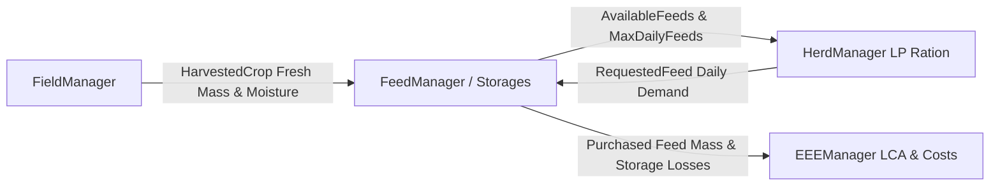

# RuFaS Feed Storage & Inventory Specialist Skill

## 1. Overview & Module Scope

The **RuFaS Feed Storage Module** (`RUFAS/biophysical/feed_storage/`), orchestrated by `FeedManager`, manages farm-grown feed inventories, storage structures (bunker silos, concrete tower silos, silage bags, grain bins, dry commodity sheds), in-storage degradation kinetics, long-term inventory forecasting, forward feed purchasing, and daily ration fulfillment.

Positioned between crop production (`FieldManager`) and herd nutrition (`HerdManager`), it ensures dietary continuity while reporting storage shrink and commercial feed procurement volumes to `EEEManager`.

> [!IMPORTANT]
> If RuFaS tools report that RuFaS is not configured, ask the user where their RuFaS project directory is located on their machine, or suggest running `rufas-setup` / setting `RUFAS_PATH`.

---

## 2. When to Use

### Triggering Conditions & Symptoms
- Configuring storage structures: bunker silos, tower silos, ag bags, grain bins, and commodity sheds.
- Setting initial inventory mass, moisture content, packing densities, and physical volumetric capacities.
- Modeling in-storage dry matter (DM) losses: fermentation shrinkage, aerobic bunk face spoilage, and effluent leachate.
- Parameterizing forward planning cycles, safety buffer margins, or `max_daily_feeds` LP bounds.
- Diagnosing premature feed stockouts, emergency spot purchases, or LP solver starvation.

### When NOT to Use
- LP diet formulation, NASEM nutrient constraints, or rumen digestion (use `rufas-animal`).
- Soil hydrology, crop growth, tillage, or harvest scheduling (use `rufas-field`).
- Whole-farm enterprise accounting, machinery diesel, or LCA carbon intensity (use `rufas-eee`).

---

## 3. Inputs & Metadata Configuration Blobs

| Blob Key | Physical File Path (Typical) | Critical Parameters |
|---|---|---|
| `feed` | `input/data/feed_management/feed_management_constants.json` | Planning cycle interval, forward projection days, safety buffer margin (10–20%), degradation intervals. |
| `feed_storage_configurations` | `input/data/feed_management/feed_storage_configurations.json` | Storage unit types (bunker, tower, bag, shed, bin), volume ($m^3$), packing density ($\text{kg DM}/m^3$), face removal rate ($\text{m/day}$). |
| `feed_storage_instances` | `input/data/feed_management/feed_storage_instances.json` | Initial feed assignment (`RUFAS_ID`), initial stored DM ($\text{kg}$), initial moisture %, storage link IDs. |
| `user_feeds` | `input/data/feed/user_feeds.json` | Feed library profiles (DM, CP, NDF, starch, $NE_L$), market purchase prices ($\$/\text{tonne}$), and purchase bounds. |

---

## 4. Core Biophysical Mechanics & Governing Equations

### 1. Bunk Face Deterioration & Aerobic Spoilage
Aerobic deterioration occurs when oxygen penetrates exposed bunker or silo faces faster than feed is removed:
$$\text{Loss}_{\text{aerobic}} = f(\text{FaceRemovalRate}, \text{PackingDensity}, \text{AmbientTemperature}, \text{OxygenDepth})$$
Maintaining packing density $\ge 225 \text{ kg DM}/m^3$ and face removal $\ge 0.15–0.30 \text{ m/day}$ prevents deep oxygen penetration and secondary heating.

### 2. Fermentation Shrinkage & Nutrient Concentration
Anaerobic fermentation transforms soluble carbohydrates into volatile fatty acids and $\text{CO}_2$ gas (`gaseous_dry_matter_loss`), concentrating non-volatile nutrients (ash, NDF, protein):
$$\text{Nutrient}_{\text{new}}\% = \frac{\text{DM}_{\text{old}} \cdot \text{Nutrient}_{\text{old}}\% \cdot (1 - \text{LossCoeff})}{\text{DM}_{\text{old}} - \text{DM}_{\text{gas\_lost}}}$$

### 3. Effluent Leachate Runoff & Storage Mass Balance
High-moisture ensiling ($>70\%$ moisture) generates effluent leachate over initial 10–14 days. Daily inventory updates follow:
$$\text{Inventory}(t) = \text{Inventory}(t-1) + \text{HarvestReceived}(t) + \text{Purchased}(t) - \text{Fed}(t) - \text{Shrinkage}(t)$$
$$\text{MaxDailyFeed}_k = \frac{\text{ProjectedInventory}_k}{\text{DaysUntilNextHarvest}_k} \cdot (1 - \text{BufferSafetyMargin})$$

---

## 5. Cross-Module Causal Flows & Feed Pathways



- **Upstream (`FieldManager`)**: Delivers harvested forage/grain crops; blended into storage instances via weighted mass averaging.
- **Downstream (`HerdManager`)**: Receives `max_daily_feeds` bounds to constrain LP diet formulation; submits daily `RequestedFeed` for delivery fulfillment.
- **Downstream (`EEEManager`)**: Ingests storage shrink and commercial feed procurement volumes for cash expenses and Scope 3 embodied GHG accounting.

---

## 6. Key Anchor Metrics & Benchmark Sanity Ranges

| Metric | Target / Benchmark Range | Anomaly Threshold & Biophysical Root Cause |
|---|---|---|
| **Bunker Silo Shrinkage %** | `8.0 – 15.0%` (Corn Silage), `6.0 – 12.0%` (Haylage) | `> 20.0%` indicates low packing density ($< 200 \text{ kg DM}/m^3$) or inadequate face removal. |
| **Aerobic Spoilage Loss** | `0.0 – 120.0 kg DM/day` | `> 200.0 kg DM/day` indicates air exposure exceeding silage feed-out rate. |
| **Tower / Silage Bag Shrink** | `4.0 – 8.0%` (Bags), `5.0 – 10.0%` (Towers) | `> 12.0%` indicates compromised seal, puncture, or unmanaged top surface. |
| **Storage Capacity Utilization** | `60.0 – 90.0%` | `> 100.0%` causes harvest overflow discard or simulation crash; `< 30.0%` indicates underutilization. |
| **Feeding Drawdown Rate** | Matches herd intake (`20.0 – 28.5 kg DM/cow-day`) | Rapid premature drawdown indicates overestimated harvest yield or omitted purchase buffers. |
| **Daily Feed Purchase Cost** | `$4.50 – $8.50 / cow-day` (`$8.00 – $14.00 / cwt milk`) | `> $10.50 / cow-day` indicates on-farm forage stockout triggering emergency spot purchases. |

---

## 7. Dynamic Graph Brain Exploration

Query the RuFaS Graph Memory Brain (`tools/rufas_brain.py`) to trace feed storage parameters, outputs, and causal pathways:

```bash
# Look up variable definitions, units, and reporter classes across the catalog
python -m tools.rufas_brain lookup-var --name storage_shrinkage
python -m tools.rufas_brain lookup-var --name stored_feed_dm

# Trace biophysical causal pathways and downstream impacts of storage inputs
python -m tools.rufas_brain trace-impact --param feed_storage_configurations
python -m tools.rufas_brain trace-impact --param feed

# OpenCypher query: Trace feed storage influence on herd diet and Scope 3 emissions
python -m tools.rufas_brain query "MATCH (p:InputParameter)-[c:CAUSALLY_INFLUENCES]->(v:OutputVariable) WHERE p.blob_name IN ['feed_storage_configurations', 'feed_storage_instances', 'feed'] RETURN p.id, v.name, c.mechanism LIMIT 15"
```

---

## 8. Diagnostic Red Flags & Rationalization Table

| Rationalization / Mistake | Reality & Correct Protocol |
|---|---|
| *"Storage capacity limits can be ignored if crop yields are high."* | Storage volume is strictly bounded by structure geometry $\times$ packing density. Overfills trigger discard or throw errors. |
| *"Zero safety buffer is acceptable to minimize feed purchase costs."* | Zero buffer causes LP diet infeasibility or emergency spot purchases at premium prices during intake spikes. |
| *"Harvested crops can be fed on the exact harvest day."* | Harvested crops must be received, inventoried, and processed through the next scheduled ration formulation interval before feeding. |

### 🚩 Diagnostic Red Flags - STOP and Correct
- **Premature Feed Stockout**: Storage level reaches 0 kg DM before the next scheduled harvest $\rightarrow$ Increase buffer safety margin or adjust forward planning days in `feed_management_constants.json`.
- **Extreme Spoilage (>20% DM Loss)**: Elevated `aerobic_face_loss_DM` $\rightarrow$ Increase bunk face removal rate ($\ge 0.20 \text{ m/day}$) or packing density ($\ge 225 \text{ kg DM}/m^3$) in `feed_storage_configurations.json`.
- **LP Solver Starvation / Infeasibility**: `RationOptimizer` fails with nutrient/forage constraints $\rightarrow$ Ensure sufficient inventory is mapped in `feed_storage_instances.json` and widen allowable commercial feeds in `user_feeds.json`.
